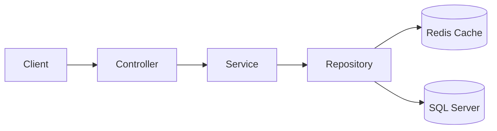
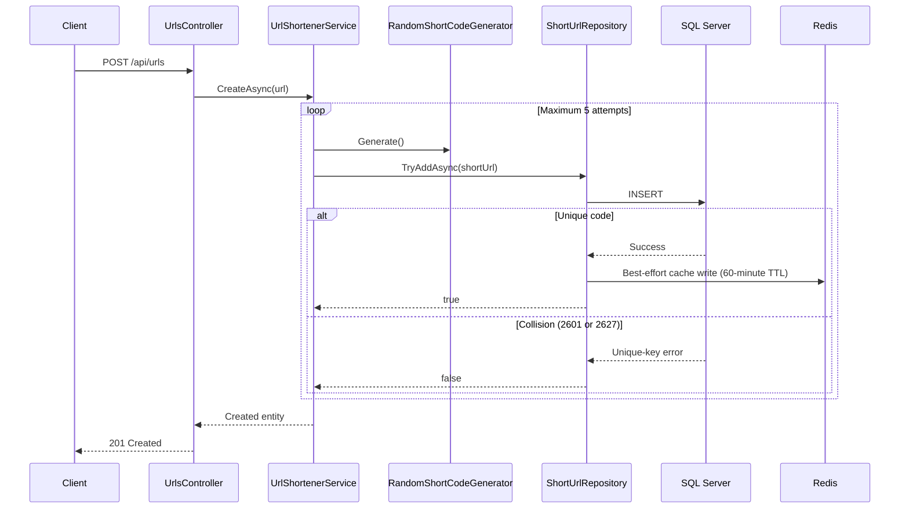
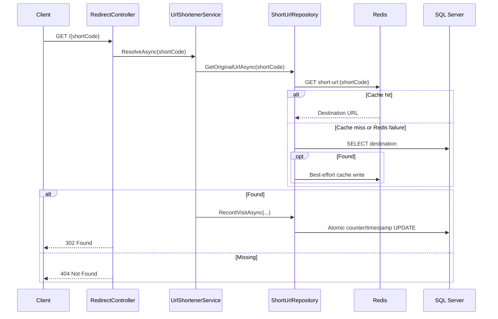
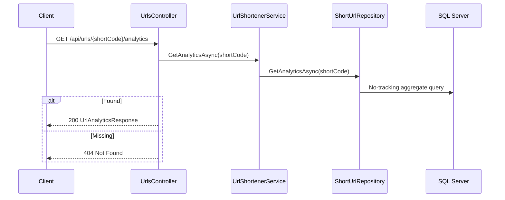

# Architecture

## Overview

The system is a single ASP.NET Core 10 deployable organized as a pragmatic three-tier layered architecture. It keeps review and deployment simple for a 2-3 day assignment while maintaining explicit responsibility boundaries.

Redis is wired through `IDistributedCache` using the StackExchange.Redis provider.

## Tiers

### Controller

- Owns routes, HTTP status codes, headers, and request/response contracts.
- Explicitly invokes FluentValidation for URL creation and returns validation Problem Details.
- Emits structured outcome logs using short codes and trace IDs without logging destination URLs.
- Delegates business behavior to `IUrlShortenerService`.
- Does not access EF Core, SQL Server, or Redis.

### Service

- Owns short-code generation policy, bounded collision retries, and redirect orchestration.
- Logs collision retries, retry exhaustion, unresolved codes, analytics misses, and visit recording using structured properties.
- Depends on interfaces rather than persistence implementations.
- Does not contain EF Core queries or SQL Server exception details.

### Repository

- Owns EF Core queries, inserts, and atomic analytics updates.
- Converts SQL unique-constraint violations into a simple collision result.
- Owns Redis cache-aside reads and best-effort cache population.

## Current Request Flows

### URL creation

### Redirect

### Analytics

Analytics bypasses Redis because SQL Server owns the current click count and last-access timestamp.

## Data Model

`ShortUrls` contains:

| Column | Purpose |
|---|---|
| `Id` | Internal identity primary key |
| `ShortCode` | Case-sensitive Base62 code with a unique index |
| `OriginalUrl` | Redirect destination |
| `CreatedAtUtc` | Creation timestamp |
| `ClickCount` | Aggregate successful redirect count |
| `LastAccessedAtUtc` | Most recent successful redirect timestamp |

`ShortCode` uses `Latin1_General_100_BIN2` collation so SQL uniqueness matches case-sensitive Base62 generation.

## Architecture Decisions

### Single deployable

Chosen to minimize operational and review complexity. Separate services would not improve this assignment's correctness or delivery quality.

### Domain-specific repository

Chosen because the requested architecture requires a repository boundary and persistence details should not leak into services. A generic CRUD repository was rejected because EF Core already supplies generic unit-of-work and repository behavior.

### Random Base62 codes

Eight characters provide $62^8$ possible values. Cryptographic random generation avoids predictable sequential codes. SQL Server's unique index is the final concurrency-safe collision authority.

### Synchronous analytics update

The redirect awaits an atomic SQL update before returning `302`. This favors simple, reliable behavior over the lifecycle and durability problems of fire-and-forget work or a background queue.

### SQL Server authority and Redis cache-aside

SQL Server owns durable state. Redis caches successful code-to-URL resolutions for 60 minutes. Creation writes SQL first and then attempts to cache. Redirects read Redis first, fall back to SQL on a miss or cache failure, and populate Redis after a successful SQL lookup. Redis failures are logged and do not fail creation or redirects.

### Validation and error handling

`UrlsController` explicitly invokes FluentValidation and rejects empty, relative, unsupported-scheme, and over-length URLs before business logic runs. ASP.NET Problem Details provides consistent validation responses. A global exception handler logs complete exceptions internally and returns a sanitized `500` with a trace ID instead of implementation details.

### Structured logging

Serilog writes structured console events with application, source, request, connection, status, duration, and trace context. Controllers log request outcomes; services log generation retries and business-operation outcomes; repositories log cache failures; the global handler logs unexpected exceptions. Request bodies and destination URLs are never logged.

### Health semantics

`/health/live` reports whether the API process can respond. `/health/ready` verifies SQL Server connectivity because SQL is required for correctness. Redis is deliberately excluded from readiness because cache failures degrade performance but the API falls back to SQL.

## Container Delivery

The Compose stack contains:

- A multi-stage, non-root ASP.NET Core 10 API image.
- SQL Server 2022 Developer with a persistent development volume.
- Official Redis 7.4 configured as an ephemeral cache.
- SQL, Redis, and API health checks with dependency-gated startup.
- Environment-only SQL credentials sourced from a gitignored `.env` file.

`Database:MigrateOnStartup` defaults to `false` and is enabled only by the single-replica local Compose stack. A scaled production deployment should apply migrations through a dedicated release job.

## Known Trade-Offs

- A cache hit avoids the destination SQL read, but every successful redirect still performs one awaited SQL analytics write.
- Redis outages add timeout latency before SQL fallback; connection timeouts should remain bounded in deployment configuration.
- Aggregate analytics do not provide individual event history.
- A single project gives logical rather than independently deployable tier separation.
- Awaited analytics adds database latency to redirects but avoids silent data loss.
- Docker Compose is a reproducible reviewer environment, not a production orchestrator.